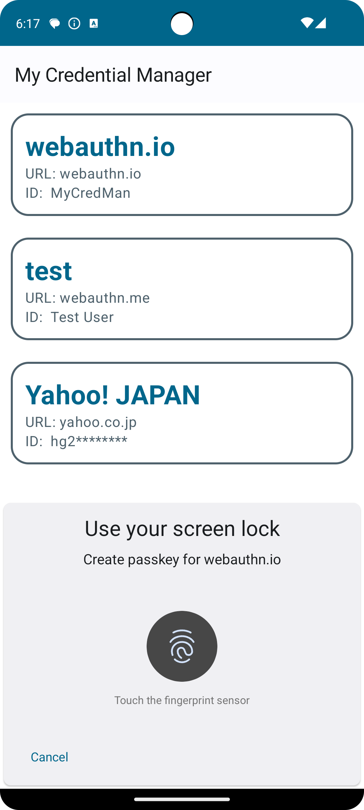

# My Credential Manager

This is a sample implementation of the Credential Management API, which is a new API introduced in Android 14. This API allows third-party apps to manage "passkeys," which were formerly known as FIDO credentials.

Part of the code is from Google's article, "Integrate Credential Manager with your credential provider solution" (https://developer.android.com/training/sign-in/credential-provider).

Please note that this code was written using Credential Manager API version beta02, and the API usage may change after this version.

This source code was created as part of the "Let's Make Club" study group, which is an activity organized by volunteers within the company. We welcome the submission of issues and pull requests, but we cannot guarantee that we will be able to respond to them in a timely manner. We recommend forking the repository and developing the code on your own.

For details about how this codebase was written, please refer to our blog articles.
- English: [Implementing "Passkey Management App" using the Credential Provider API newly available from Android 14](https://developers.kddi.com/blog/2esxXGTcSBSaGLTJO0dC67)
- Chinese: [用Credential Provider API试做了通行密钥管理APP](https://developers.kddi.com/blog/1RLrbZlhxjGzZ4fE5bzJmy)
- Japanese: [パスキー管理アプリ作ってみた](https://developers.kddi.com/blog/2hb9zXuXGEALOsLqCxXEHS)

## Screenshot:

## Authors:
- Junzi Zhang (@junzi-zhang)
- Rikuto Ohike (@xri-ooike)
- Kosuke Koiwai (@ko-koiwai)